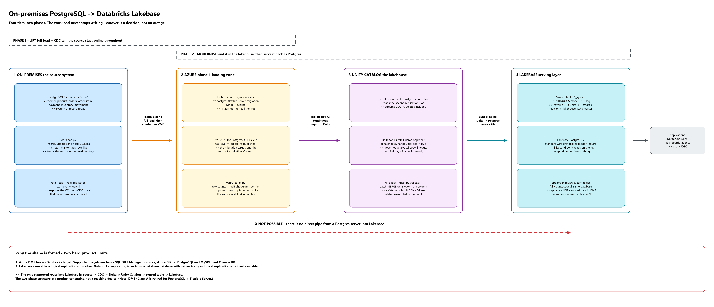

# Lakebase Migration Demo

A 30-minute, runnable demo that moves a live on-premises PostgreSQL OLTP
workload to Databricks Lakebase - **without stopping the writes**.



```
 on-premises        Azure Database          Unity Catalog        Lakebase
 PostgreSQL   --->  for PostgreSQL   --->      Delta      --->   Postgres
                    Flexible Server        retail_demo.onprem    (synced)
      ^
 workload.py  (continuous OLTP: inserts, updates, and real DELETEs)

      |<--- Phase 1: lift --->|<-------- Phase 2: modernise -------->|
         migration service        Lakeflow Connect   synced tables
         (Online / CDC)           (logical decoding) (CONTINUOUS)
```

A retail orders/payments schema, a workload generator that keeps the source
under load, an online CDC migration into Azure, ingestion into the lakehouse,
and synced tables that serve the data back out over the plain Postgres wire
protocol.

## Read these in order

| Doc | What it gives you |
| --- | --- |
| [`docs/01-architecture.md`](docs/01-architecture.md) | How it fits together, and the two product constraints that force this shape |
| [`docs/02-setup-guide.md`](docs/02-setup-guide.md) | Step-by-step build, ~60 min first time |
| [`docs/03-demo-script.md`](docs/03-demo-script.md) | Minute-by-minute run of show, with the talk track |
| [`docs/architecture.excalidraw`](docs/architecture.excalidraw) | Editable source for the diagram above |

## Contents

```
sql/     01_onprem_schema.sql      retail OLTP schema, CDC-friendly single-column PKs
         02_enable_cdc.sql         replicator role + publication

src/     config.py                 .env-driven DSNs for all four tiers
         setup_onprem.py           create + seed the source database
         workload.py               continuous OLTP generator (--tps, --marker)
         verify_parity.py          row counts + checksums across tiers

infra/   01_provision_azure.ps1    RG, optional source VM, Azure PG Flex v17
         02_run_migration.ps1      online migration + status watch + cutover
         teardown.ps1              delete the resource group

databricks/
         01_lakeflow_connect.md    managed Postgres connector setup
         01b_jdbc_ingest.py        notebook fallback (batch MERGE)
         02_create_synced_tables.py  Delta -> Lakebase synced tables
         03_serve_queries.sql      the payoff queries, run against Lakebase
         99_teardown.sql           clean up the Databricks side
```

## Quick start

```powershell
python -m venv .venv; .\.venv\Scripts\Activate.ps1
pip install -r requirements.txt
Copy-Item .env.example .env        # fill it in

python src\setup_onprem.py         # needs wal_level = logical
python src\workload.py --tps 5 --duration 30
python src\verify_parity.py
```

If those four commands work, the local half is sound. Only then spend money in
Azure - see the setup guide.

## Two things to know before you present this

**Azure DMS has no Databricks target.** Supported targets are Azure SQL
DB/MI, Azure Database for PostgreSQL and MySQL, and Cosmos DB.

**Lakebase cannot be a logical replication subscriber.** Databricks state this
is not yet available.

Together those mean the only supported route into Lakebase is
`source -> CDC -> Delta in Unity Catalog -> synced table -> Lakebase`. The
two-phase structure of this demo is a product constraint, not a simplification.
Also note DMS *Classic* is retired for PostgreSQL to Flexible Server; the
current tool is `az postgres flexible-server migration`, which is what
`infra/02_run_migration.ps1` calls.

## Cross-cloud note

This demo was built against a **Databricks-on-AWS** workspace, so the path is
deliberately cross-cloud:

```
on-prem PostgreSQL -> Azure PG Flexible Server -> (public internet) -> AWS Databricks -> Lakebase
```

That works - Lakeflow Connect reaches the Azure PG public endpoint - but it has
two consequences worth planning for:

- **Firewall.** The Azure PG server must allow the Databricks serverless egress
  IPs for your AWS workspace region, not an Azure range.
- **Egress + latency.** Cross-cloud CDC adds latency and egress cost. Fine for a
  30-minute demo; call it out rather than let someone spot it.

If you later move to an Azure Databricks workspace, nothing in this repo changes
except the firewall rule and `DATABRICKS_HOST`, and you can use a private
endpoint instead of a public one.

## Costs

The Azure resource group is the expensive part (PG Flexible Server plus the
optional source VM). Run `infra/teardown.ps1` the moment the session ends, then
`databricks/99_teardown.sql`, then delete the Lakebase project - it bills
separately from the Azure resource group.

## Data

All data is synthetic, generated by Faker. No customer names, no real orders,
no production identifiers.

## Licence

MIT - see [LICENSE](LICENSE).
